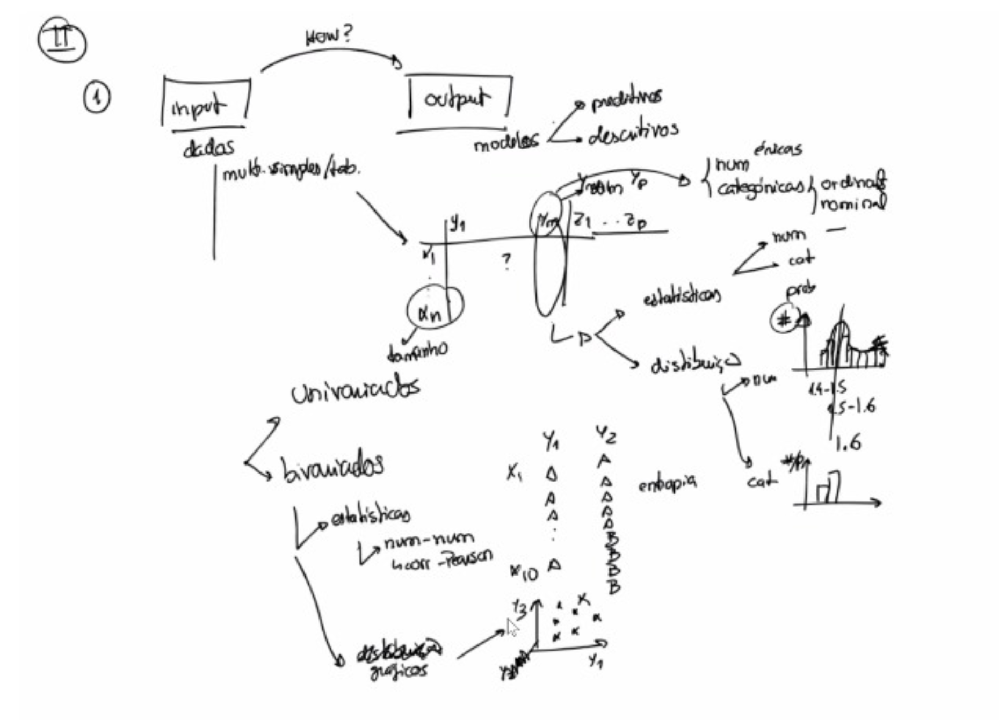
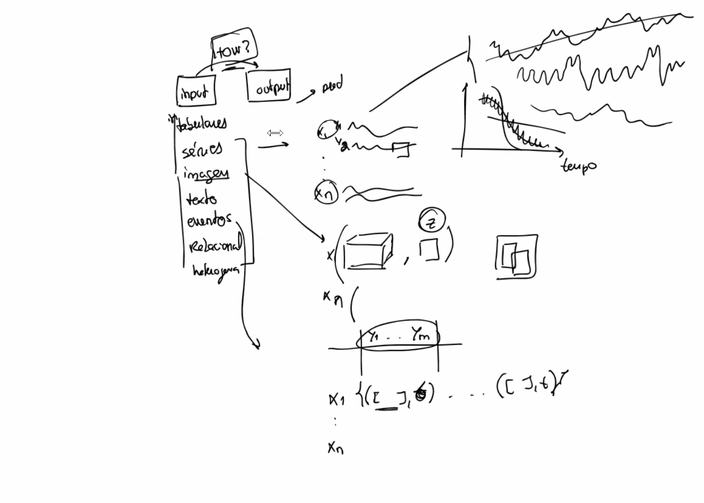
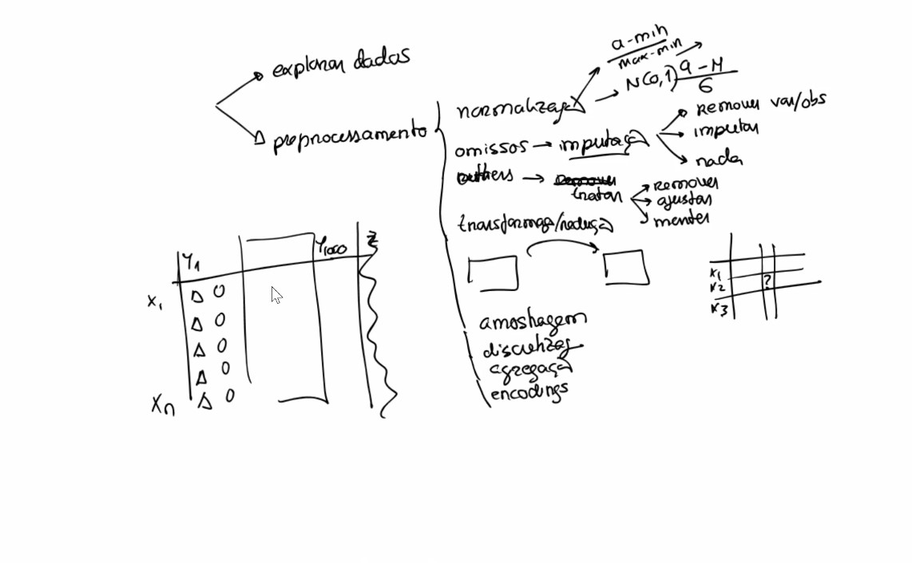

# notas para aulas de non supervised

# aula 1

## analise de correlaçao

- anova, chi quadrado
- dataset com carateristicas demograficas e muitas carateristicas. fazem se testes para avaliar redundancia e avaliaçao de poder preditivo sobre as mesmas variaveis
- variaveis entrada vs variaveis de saida

## exploracao: input vs output

- dados tabulares: series, imagem, texto, eventos, relacional
- exemplo imagem. input: imagem. cada pixel será uma variavel. output: label (por exemplo: é um cão?)

## data Exploration and preprocessing

- exercicio: https://web.ist.utl.pt/rmch/dash/guides/DataExploration.html
- usou-se dataset 'virus' em vez de 'iris'
- referencia a metodos de pre processamento (MVs, outliers, scaling, balancing, discretizaçao, enconding)

## clustering

1. Descriçao com explicabilidade dos preditores, clustering
2. aplicaçao (cenarios, educaçao, ecommerce (catalogo, comportamental))
3. clustering 
    - simples vs hierarquicas
    - exclusivas vs nao exclusivas
    - suaves vs estritas (hard)

# aula 2

