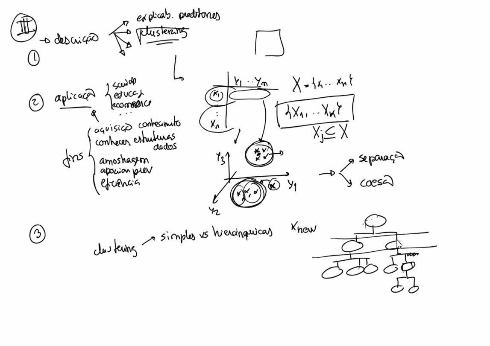

# notas para aulas de non supervised

# aula 1

## analise de correlaçao

- anova, chi quadrado
- dataset com carateristicas demograficas e muitas carateristicas. fazem se testes para avaliar redundancia e avaliaçao de poder preditivo sobre as mesmas variaveis
- variaveis entrada vs variaveis de saida

## exploracao: input vs output

- dados tabulares: series, imagem, texto, eventos, relacional
- exemplo imagem. input: imagem. cada pixel será uma variavel. output: label (por exemplo: é um cão?)

## data Exploration and preprocessing

- exercicio: https://web.ist.utl.pt/rmch/dash/guides/DataExploration.html
- usou-se dataset 'virus' em vez de 'iris'
- referencia a metodos de pre processamento (MVs, outliers, scaling, balancing, discretizaçao, enconding)

## clustering part 1
https://e.tecnicomais.pt/pluginfile.php/350464/mod_resource/content/4/03a%20Clustering%20Part1.pdf

1. Descriçao com explicabilidade dos preditores, clustering
2. aplicaçao (cenarios, educaçao, ecommerce (catalogo, comportamental))
3. clustering 
    - simples vs hierarquicas
    - exclusivas vs nao exclusivas
    - suaves vs estritas (hard)

# aula 2

## clustering part 2
https://e.tecnicomais.pt/pluginfile.php/350467/mod_resource/content/3/03b%20Clustering%20Part2.pdf

- observaçao de dados em matriz, exploraçao, amostragem e eficiencia. Referencia a distancia das observaçoes (ex: knn)

### Clustering features:
#### 1. distance
 
- numeric, nominal, ordinal, non iid (multivariate, time series, image, geo, events)
    - nominal usa a distancia Hamming

    - distancia euclidiana, manhattan, chebyshev, coseno
        - tbm se pode calcular correlaçao pearson, spearman
    - escolha de semelhança vs distancia depende do conhecimento de dominio

### 2. approach (abordagens)

- partitioning, hierarchical, density-based, model-based
    - atençao a questao de dummyfication. é so para itens com cardinalidade maior que 2 sem ordem.
    - hierarquicos existem algoritmos aglomerativos e divisivos

