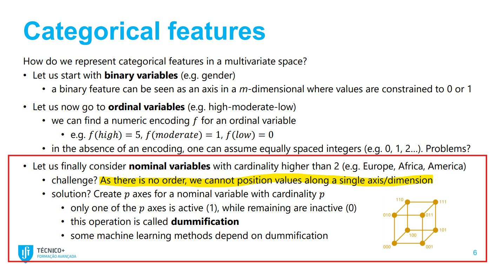
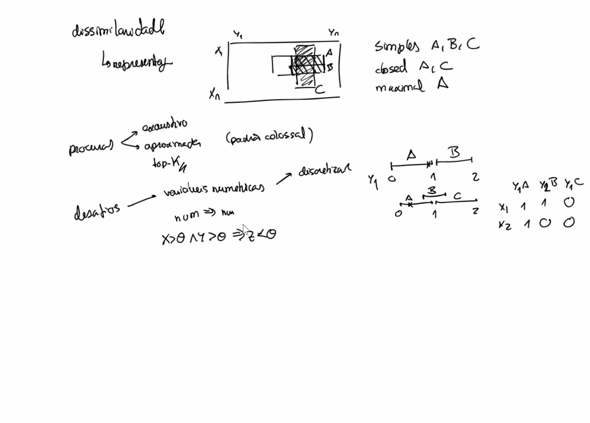

# notas para aulas de non supervised

# aula 1


## analise de correlaçao


- anova, chi quadrado
- dataset com carateristicas demograficas e muitas carateristicas. fazem se testes para avaliar redundancia e avaliaçao de poder preditivo sobre as mesmas variaveis
- variaveis entrada vs variaveis de saida


## exploracao: input vs output


- dados tabulares: series, imagem, texto, eventos, relacional
- exemplo imagem. input: imagem. cada pixel será uma variavel. output: label (por exemplo: é um cão?)


## data Exploration and preprocessing


- exercicio: https://web.ist.utl.pt/rmch/dash/guides/DataExploration.html
- usou-se dataset 'virus' em vez de 'iris'
- referencia a metodos de pre processamento (MVs, outliers, scaling, balancing, discretizaçao, enconding)

## clustering part 1
https://e.tecnicomais.pt/pluginfile.php/350464/mod_resource/content/4/03a%20Clustering%20Part1.pdf


### 1. Descriçao com explicabilidade dos preditores, clustering
### 2. aplicaçao (cenarios, educaçao, ecommerce (catalogo, comportamental))

### 3. clustering 
- simples vs hierarquicas
- exclusivas vs nao exclusivas
- suaves vs estritas (hard)


# aula 2

## clustering part 2
https://e.tecnicomais.pt/pluginfile.php/350467/mod_resource/content/3/03b%20Clustering%20Part2.pdf




- observaçao de dados em matriz, exploraçao, amostragem e eficiencia. Referencia a distancia das observaçoes (ex: knn)


### Clustering features:
#### 1. distance
 
- numeric, nominal, ordinal, non iid (multivariate, time series, image, geo, events)
    - nominal usa a distancia Hamming

    - distancia euclidiana, manhattan, chebyshev, coseno
        - tbm se pode calcular correlaçao pearson, spearman
    - escolha de semelhança vs distancia depende do conhecimento de dominio

### 2. approach (abordagens)


    - atençao a questao de dummyfication. é so para itens com cardinalidade maior que 2 sem ordem.
    - partitioning, hierarchical, density-based, model-based

### Density Based
Density-based clustering is a method that identifies clusters in data by looking for regions of high density separated by regions of low density. One of the most popular algorithms for density-based clustering is DBSCAN (Density-Based Spatial Clustering of Applications with Noise). DBSCAN groups together points that are closely packed together, marking as outliers points that lie alone in low-density regions. It is particularly effective for discovering clusters of arbitrary shape and for handling noise in the data. For more details, refer to the [DBSCAN documentation](https://scikit-learn.org/1.5/modules/generated/sklearn.cluster.DBSCAN.html).

### partitioning clustering
Partitioning clustering is a method that divides the data into distinct clusters, where each data point belongs to exactly one cluster. The goal is to optimize the partitioning by minimizing the within-cluster variance. One of the most common algorithms for partitioning clustering is K-means, which iteratively assigns data points to clusters based on the nearest mean value. Another popular algorithm is K-medoids, which is more robust to noise and outliers. For more details, refer to the [K-means documentation](https://scikit-learn.org/stable/modules/generated/sklearn.cluster.KMeans.html).

### hierarchical clustering

Hierarchical clustering is a method of cluster analysis which seeks to build a hierarchy of clusters. There are two main types of hierarchical clustering algorithms: agglomerative and divisive. Agglomerative clustering is a "bottom-up" approach where each observation starts in its own cluster, and pairs of clusters are merged as one moves up the hierarchy. Divisive clustering is a "top-down" approach where all observations start in one cluster, and splits are performed recursively as one moves down the hierarchy. This method is particularly useful for data that has a nested structure. For more details, refer to the [Hierarchical Clustering documentation](https://scikit-learn.org/stable/modules/clustering.html#hierarchical-clustering).


### model-based clustering
Model-based clustering is a method that assumes the data is generated by a mixture of underlying probability distributions, each representing a different cluster. This approach uses statistical models to estimate the parameters of these distributions and assign data points to clusters based on the likelihood of belonging to each distribution. One of the most common algorithms for model-based clustering is the Gaussian Mixture Model (GMM), which assumes that the data is generated from a mixture of Gaussian distributions. For more details, refer to the [Gaussian Mixture Model documentation](https://scikit-learn.org/stable/modules/mixture.html).


### Exercicio Clustering

- notebook https://web.ist.utl.pt/rmch/dash/guides/Clustering%20in%20Python.html
- exercicio pratico https://web.ist.utl.pt/rmch/dash/exercises/01%20Clustering.pdf
- soluçao exercicio https://web.ist.utl.pt/rmch/dash/exercises/01%20Clustering%20Solutions.pdf 

##### para agglomerative clustering pode-se usar sklearn ou formula especifica 
```python
from sklearn.metrics import pairwise_distances

def mydistance(x1, x2):
    res = 0.0001
    for j, weight in enumerate([1,2,3,1]):
        res += weight*abs(x1[j]-x2[j])
    return res

def sim_affinity(X):
    return pairwise_distances(X, metric=mydistance)
```

### Avaliaçao

#### Cohesion vs Separation

In clustering, cohesion and separation are two important measures used to evaluate the quality of the clusters formed.

**Cohesion** (also known as intra-cluster distance) measures how closely related the items in a cluster are. It is typically quantified by the Sum of Squared Errors (SSE), which calculates the total squared distance between each data point and the centroid of its assigned cluster. A lower cohesion value indicates that the data points within a cluster are closer to each other, suggesting a more compact and well-defined cluster.

**Separation** (also known as inter-cluster distance) measures how distinct or well-separated a cluster is from other clusters. It is often quantified by metrics such as the Silhouette Score, which considers both the cohesion within clusters and the separation between clusters. A higher separation value indicates that the clusters are more distinct from each other, suggesting better-defined boundaries between clusters.

For more details, refer to the [Silhouette Score documentation](https://scikit-learn.org/stable/modules/generated/sklearn.metrics.silhouette_score.html).

```python
from sklearn.metrics import silhouette_score

# Sample data
X = np.array([[1, 2], [1, 4], [1, 0],
              [4, 2], [4, 4], [4, 0]])

# KMeans clustering
kmeans = KMeans(n_clusters=2, random_state=0).fit(X)

# Calculate Silhouette Score
sil_score = silhouette_score(X, kmeans.labels_)
print(f'Silhouette Score: {sil_score}')
```

#### SSE (Cohesion)

Sum of Squared Errors (SSE) is a metric used to evaluate the performance of clustering algorithms. It measures the total squared distance between each data point and the centroid of its assigned cluster. A lower SSE indicates that the data points are closer to their respective centroids, suggesting better clustering performance. For more details, refer to the [SSE documentation](https://en.wikipedia.org/wiki/Residual_sum_of_squares).

```python
from sklearn.cluster import KMeans
import numpy as np

# Sample data
X = np.array([[1, 2], [1, 4], [1, 0],
              [4, 2], [4, 4], [4, 0]])

# KMeans clustering
kmeans = KMeans(n_clusters=2, random_state=0).fit(X)

# Calculate SSE
sse = kmeans.inertia_
print(f'Sum of Squared Errors (SSE): {sse}')
```


# Aula 3 25/01/2025

## Clustering part 3


### Clustering Evaluation Methods

Evaluating clustering results is crucial to ensure the quality and effectiveness of the clustering algorithm. Here are some common methods used for clustering evaluation:

#### 1. Silhouette Score
The Silhouette Score measures how similar an object is to its own cluster compared to other clusters. It ranges from -1 to 1, where a higher value indicates better-defined clusters.
```python
from sklearn.metrics import silhouette_score
sil_score = silhouette_score(X, kmeans.labels_)
```

#### 2. Sum of Squared Errors (SSE)
SSE measures the total squared distance between each data point and the centroid of its assigned cluster. Lower SSE values indicate more compact clusters.
```python
sse = kmeans.inertia_
```

#### 3. Davies-Bouldin Index
The Davies-Bouldin Index evaluates the average similarity ratio of each cluster with its most similar cluster. Lower values indicate better clustering.
```python
from sklearn.metrics import davies_bouldin_score
db_index = davies_bouldin_score(X, kmeans.labels_)
```

#### 4. Dunn Index
The Dunn Index is the ratio of the minimum inter-cluster distance to the maximum intra-cluster distance. Higher values indicate better clustering.

#### 5. Adjusted Rand Index (ARI)
ARI measures the similarity between the true labels and the clustering labels, adjusted for chance. It ranges from -1 to 1, with higher values indicating better clustering.
```python
from sklearn.metrics import adjusted_rand_score
ari = adjusted_rand_score(true_labels, kmeans.labels_)
```

These methods help in assessing the performance of clustering algorithms and ensuring the formation of meaningful and well-separated clusters.

## Outlier Analysis


Outlier analysis is the process of identifying and analyzing data points that deviate significantly from the rest of the dataset. Outliers can occur due to variability in the data, measurement errors, or experimental errors. Detecting and handling outliers is crucial as they can significantly affect the results of data analysis and machine learning models.

### Types of Outliers/Anomalies

Outliers or anomalies can be categorized based on their characteristics and the context in which they occur. Here are some common types:

#### Global Outliers (Point Anomalies)
Global outliers, also known as point anomalies, are individual data points that deviate significantly from the rest of the dataset. These outliers are unusual with respect to the entire dataset.
- **Example**: A temperature reading of 100°C in a dataset of daily temperatures ranging between 20°C and 30°C.

#### Contextual Outliers (Conditional Anomalies)
Contextual outliers, also known as conditional anomalies, are data points that are considered normal in one context but anomalous in another. The context can be defined by time, space, or other attributes.
- **Example**: A temperature of 30°C might be normal in summer but anomalous in winter.

#### Collective Outliers
Collective outliers are a group of data points that are anomalous when considered together but not necessarily when considered individually. These outliers often indicate a pattern or a sequence that deviates from the norm.
- **Example**: A sudden spike in network traffic over a short period, which might indicate a potential security breach.

Understanding the type of outliers is crucial for selecting appropriate detection methods and handling strategies. Each type of outlier requires different techniques for identification and analysis to ensure accurate and reliable results in data analysis and machine learning models.


### univariate vs Multivariate Outliers

#### Univariate Outliers
Univariate outliers are data points that are unusual with respect to a single variable. Common methods to detect univariate outliers include:

- **Z-Score**: Measures how many standard deviations a data point is from the mean. Data points with a Z-score greater than a threshold (e.g., 3 or -3) are considered outliers.
    ```python
    from scipy.stats import zscore
    import numpy as np

    data = np.array([10, 12, 12, 13, 12, 11, 14, 13, 100])
    z_scores = zscore(data)
    outliers = np.where(np.abs(z_scores) > 3)
    print(f'Univariate Outliers: {data[outliers]}')
    ```

- **IQR (Interquartile Range)**: Measures the spread of the middle 50% of the data. Data points outside 1.5 times the IQR above the third quartile or below the first quartile are considered outliers.
    ```python
    Q1 = np.percentile(data, 25)
    Q3 = np.percentile(data, 75)
    IQR = Q3 - Q1
    lower_bound = Q1 - 1.5 * IQR
    upper_bound = Q3 + 1.5 * IQR
    outliers = data[(data < lower_bound) | (data > upper_bound)]
    print(f'Univariate Outliers: {outliers}')
    ```

#### Multivariate Outliers
Multivariate outliers are data points that are unusual with respect to multiple variables. Common methods to detect multivariate outliers include:

- **Mahalanobis Distance**: Measures the distance of a data point from the mean of a multivariate distribution, taking into account the correlations between variables.
    ```python
    import numpy as np
    from scipy.spatial.distance import mahalanobis

    data = np.array([[10, 12], [12, 13], [12, 11], [14, 13], [100, 200]])
    mean = np.mean(data, axis=0)
    cov_matrix = np.cov(data, rowvar=False)
    inv_cov_matrix = np.linalg.inv(cov_matrix)
    distances = [mahalanobis(x, mean, inv_cov_matrix) for x in data]
    threshold = np.percentile(distances, 97.5)
    outliers = data[np.array(distances) > threshold]
    print(f'Multivariate Outliers: {outliers}')
    ```

- **Isolation Forest**: An unsupervised learning algorithm that isolates observations by randomly selecting a feature and then randomly selecting a split value between the maximum and minimum values of the selected feature.
    ```python
    from sklearn.ensemble import IsolationForest

    data = np.array([[10, 12], [12, 13], [12, 11], [14, 13], [100, 200]])
    iso_forest = IsolationForest(contamination=0.1)
    outliers = iso_forest.fit_predict(data)
    print(f'Multivariate Outliers: {data[outliers == -1]}')
    ```

Detecting and handling outliers is essential to ensure the accuracy and reliability of data analysis and machine learning models. Depending on the context, outliers can be removed, transformed, or analyzed further to understand their impact on the data.


## Unsupervised Learning Paradigms

Unsupervised learning involves training a model on data without labeled responses. The goal is to uncover hidden patterns or intrinsic structures in the data. Here are some key paradigms in unsupervised learning:

### Model-Based Paradigms
Model-based paradigms assume that the data is generated by a mixture of underlying probability distributions. These models estimate the parameters of these distributions and assign data points to clusters based on the likelihood of belonging to each distribution. A common example is the Gaussian Mixture Model (GMM).

### Density-Based Paradigms
Density-based paradigms identify clusters in data by looking for regions of high density separated by regions of low density. DBSCAN (Density-Based Spatial Clustering of Applications with Noise) is a popular algorithm that groups closely packed points and marks points in low-density regions as outliers.

### Distance-Based Paradigms
Distance-based paradigms rely on the distance between data points to form clusters. These methods use various distance metrics such as Euclidean, Manhattan, and Hamming distances. K-means is a well-known distance-based clustering algorithm that partitions data into clusters by minimizing the within-cluster variance.

### Clustering Paradigms
Clustering paradigms aim to partition the data into distinct groups or clusters. Each data point belongs to one cluster, and the goal is to ensure that points within a cluster are more similar to each other than to points in other clusters. Clustering can be further categorized into:

- **Partitioning Clustering**: Divides data into distinct clusters, e.g., K-means.
- **Hierarchical Clustering**: Builds a hierarchy of clusters using agglomerative or divisive approaches.
- **Density-Based Clustering**: Identifies clusters based on data density, e.g., DBSCAN.
- **Model-Based Clustering**: Uses statistical models to represent clusters, e.g., GMM.

These paradigms provide various approaches to uncovering the underlying structure of data, each with its strengths and suitable applications.


## Metodos clustering / analise


## Unsupervised Analysis


### Dimensionality Reduction
Dimensionality reduction techniques reduce the number of features in a dataset while preserving its essential structure. This helps in visualizing high-dimensional data and improving the performance of machine learning algorithms. Common dimensionality reduction methods include:
- **Principal Component Analysis (PCA)**: Transforms data into a lower-dimensional space by identifying the principal components that capture the most variance.
- **t-Distributed Stochastic Neighbor Embedding (t-SNE)**: Reduces dimensionality while preserving the local structure of the data, often used for visualization.
- **Linear Discriminant Analysis (LDA)**: Projects data onto a lower-dimensional space to maximize class separability, primarily used for supervised learning.


## Principal Component Analysis (PCA)


Principal Component Analysis (PCA) is a widely used dimensionality reduction technique that transforms data into a lower-dimensional space while preserving as much variance as possible. PCA achieves this by identifying the principal components, which are orthogonal directions in the data that capture the most variance.

### Steps in PCA
1. **Standardize the Data**: Ensure that each feature has a mean of zero and a standard deviation of one.
2. **Compute the Covariance Matrix**: Calculate the covariance matrix to understand the relationships between features.
3. **Calculate Eigenvalues and Eigenvectors**: Determine the eigenvalues and eigenvectors of the covariance matrix. The eigenvectors represent the principal components, and the eigenvalues indicate the amount of variance captured by each component.
4. **Sort and Select Principal Components**: Sort the eigenvalues in descending order and select the top k eigenvectors corresponding to the largest eigenvalues.
5. **Transform the Data**: Project the original data onto the selected principal components to obtain the lower-dimensional representation.

### Benefits of PCA
- **Dimensionality Reduction**: Reduces the number of features, making data easier to visualize and analyze.
- **Noise Reduction**: Removes noise and redundant features, improving the performance of machine learning models.
- **Feature Extraction**: Identifies the most important features that capture the underlying structure of the data.

### Example of PCA in Python
```python
from sklearn.decomposition import PCA
import numpy as np

# Sample data
X = np.array([[2.5, 2.4], [0.5, 0.7], [2.2, 2.9], [1.9, 2.2], [3.1, 3.0], [2.3, 2.7], [2, 1.6], [1, 1.1], [1.5, 1.6], [1.1, 0.9]])

# Standardize the data
X_standardized = (X - np.mean(X, axis=0)) / np.std(X, axis=0)

# Apply PCA
pca = PCA(n_components=2)
X_pca = pca.fit_transform(X_standardized)

print("Principal Components:\n", pca.components_)
print("Explained Variance Ratio:\n", pca.explained_variance_ratio_)
```

PCA is a powerful tool for simplifying complex datasets, making it easier to identify patterns and relationships in the data.


# Aula 4 01/02/2025

## Descoberta de padrões (Pattern Mining)


https://e.tecnicomais.pt/pluginfile.php/350479/mod_resource/content/3/05a%20PatternMiningIntro.pdf

## Introduction to Pattern Mining and Association Rules

Pattern mining is a crucial aspect of data mining that focuses on discovering interesting patterns, associations, and relationships within large datasets. It involves identifying frequent itemsets, sequences, or substructures that occur together in a dataset. One of the most common applications of pattern mining is in market basket analysis, where the goal is to find associations between items purchased together by customers.

**Association Rules**

Association rules are a popular method in pattern mining used to identify relationships between variables in large datasets. These rules are typically represented in the form of "if-then" statements, where the presence of certain items in a transaction implies the presence of other items. The main components of association rules are:

### **Support** 

The support of an itemset is the proportion of transactions in the dataset that contain the itemset. It measures the frequency of occurrence of the itemset. Example: The percentage of transactions that include both bread and butter.


### Confidence vs Lift: Calculations and Interpretation


#### Confidence
Confidence measures the reliability of an association rule. It is calculated as the ratio of the number of transactions containing both the antecedent and the consequent to the number of transactions containing the antecedent. 
The confidence of a rule is the proportion of transactions containing \the antecedent that also contain the consequent. It measures the reliability of the rule. Example: The percentage of transactions that include bread and also include butter.


**Formula:**
\[ \text{Confidence}(A \Rightarrow B) = \frac{\text{Support}(A \cap B)}{\text{Support}(A)} \]

**Example:**
Consider a dataset with 100 transactions:
- 20 transactions contain bread.
- 15 transactions contain both bread and butter.

The confidence of the rule "bread ⇒ butter" is:
\[ \text{Confidence}(\text{bread} \Rightarrow \text{butter}) = \frac{15}{20} = 0.75 \]

**Interpretation:**
This means that 75% of the transactions that contain bread also contain butter.

#### Lift
Lift measures the strength of an association rule by comparing the observed support to the expected support if the antecedent and consequent were independent.
The lift of a rule is the ratio of the observed support to the expected support if the antecedent and consequent were independent. It measures the strength of the association between the items. A lift value greater than 1 indicates a positive association, meaning the items are more likely to be purchased together than expected by chance. Example: If the lift of the rule "bread ⇒ butter" is 1.5, it means that the likelihood of buying butter when bread is purchased is 1.5 times higher than if the two items were independent.

**Formula:**
\[ \text{Lift}(A \Rightarrow B) = \frac{\text{Support}(A \cap B)}{\text{Support}(A) \times \text{Support}(B)} \]

**Example:**
Consider the same dataset with 100 transactions:
- 20 transactions contain bread.
- 30 transactions contain butter.
- 15 transactions contain both bread and butter.

The lift of the rule "bread ⇒ butter" is:
\[ \text{Lift}(\text{bread} \Rightarrow \text{butter}) = \frac{15/100}{(20/100) \times (30/100)} = \frac{0.15}{0.06} = 2.5 \]

**Interpretation:**
This means that the likelihood of buying butter when bread is purchased is 2.5 times higher than if the two items were independent.

#### Python Example
```python
import pandas as pd
from mlxtend.preprocessing import TransactionEncoder
from mlxtend.frequent_patterns import association_rules, apriori

# Sample data
transactions = [
    ['bread', 'butter'],
    ['bread'],
    ['butter'],
    ['bread', 'butter'],
    ['bread', 'butter'],
    ['butter']
]

# Convert transactions to one-hot encoded DataFrame
te = TransactionEncoder()
te_ary = te.fit(transactions).transform(transactions)
df = pd.DataFrame(te_ary, columns=te.columns_)

# Apply Apriori algorithm
frequent_itemsets = apriori(df, min_support=0.1, use_colnames=True)

# Generate association rules
rules = association_rules(frequent_itemsets, metric="confidence", min_threshold=0.1)

# Display rules with confidence and lift
print(rules[['antecedents', 'consequents', 'support', 'confidence', 'lift']])
```

In this example:
- We define a list of transactions.
- We use `TransactionEncoder` to convert the transactions into a one-hot encoded DataFrame.
- We apply the `apriori` function to find frequent itemsets with a minimum support of 0.1.
- We generate association rules with a minimum confidence threshold of 0.1 and display the rules with their support, confidence, and lift values.

This example helps in understanding how confidence and lift are calculated and interpreted in the context of association rule mining.

### Categories of Association Rules

Association rules can be classified into different categories based on the type of data and the nature of the relationships they capture. Here are the main categories:

##### 1. Boolean Association Rules
Boolean association rules are used in transactional, sequential, and categorical multivariate data. These rules identify the presence or absence of items in transactions.
- **Example**: Keyboard ⇒ Mouse [sup=6%, conf=70%]
    - **Support**: 6% of transactions contain both a keyboard and a mouse.
    - **Confidence**: 70% of transactions that contain a keyboard also contain a mouse.

##### 2. Quantitative Association Rules
Quantitative association rules are used in numeric data. These rules identify relationships between numeric attributes and their ranges.
- **Example**: Age ∈ [26,30] ⇒ Cars ∈ {1,2} [sup=3%, conf=36%]
    - **Support**: 3% of transactions involve customers aged between 26 and 30 who own 1 or 2 cars.
    - **Confidence**: 36% of transactions involving customers aged between 26 and 30 also involve owning 1 or 2 cars.

##### 3. Hybrid Association Rules
Hybrid association rules are used in mixed multivariate data, transactions with numeric outcomes, and other complex data types. These rules combine both categorical and numeric attributes.
- **Example**: Age ∈ [26,30] ∧ Keyboard ⇒ Mouse ∈ {1,2}
    - This rule indicates that customers aged between 26 and 30 who buy a keyboard are likely to buy 1 or 2 mice.

These categories help in identifying and analyzing different types of relationships in various datasets, providing valuable insights for decision-making and strategic planning.


### Algorithms for Association Rule Mining

Several algorithms are used for mining association rules, including:

- **Apriori Algorithm**: This algorithm generates frequent itemsets by iteratively expanding them one item at a time and pruning itemsets that do not meet the minimum support threshold.
- **FP-Growth Algorithm**: This algorithm uses a compact data structure called the FP-tree to represent the dataset and extract frequent itemsets without candidate generation.
- **Eclat Algorithm**: This algorithm uses a depth-first search strategy to find frequent itemsets by intersecting transaction lists.

Pattern mining and association rules are powerful tools for uncovering hidden patterns and relationships in data, providing valuable insights for decision-making and strategic planning.


### Example of FP-Growth in Python

The FP-Growth algorithm is an efficient method for mining frequent itemsets without candidate generation. Below is an example of how to apply the FP-Growth algorithm using the `mlxtend` library in Python.

First, install the `mlxtend` library if you haven't already:
```bash
pip install mlxtend
```

Here's an example of applying FP-Growth to a dataset of transactions:

```python
import pandas as pd
from mlxtend.preprocessing import TransactionEncoder
from mlxtend.frequent_patterns import fpgrowth

# Sample data
transactions = [
    ['milk', 'bread', 'butter'],
    ['bread', 'butter'],
    ['milk', 'bread'],
    ['milk', 'butter'],
    ['bread', 'butter', 'jam'],
    ['milk', 'bread', 'butter', 'jam']
]

# Convert transactions to one-hot encoded DataFrame
te = TransactionEncoder()
te_ary = te.fit(transactions).transform(transactions)
df = pd.DataFrame(te_ary, columns=te.columns_)

# Apply FP-Growth algorithm
frequent_itemsets = fpgrowth(df, min_support=0.5, use_colnames=True)

print(frequent_itemsets)
```

In this example:
- We define a list of transactions.
- We use `TransactionEncoder` to convert the transactions into a one-hot encoded DataFrame.
- We apply the `fpgrowth` function to find frequent itemsets with a minimum support of 0.5.

The output will be a DataFrame of frequent itemsets and their support values.

For more details, refer to the [mlxtend documentation](http://rasbt.github.io/mlxtend/user_guide/frequent_patterns/fpgrowth/).


## Condensed Patterns

Condensed patterns are a subset of frequent patterns that provide a more compact and informative representation of the data. They help reduce the number of patterns to be analyzed while retaining the essential information. Here are some key types of condensed patterns:



### Closed Patterns
Closed patterns are frequent itemsets for which there are no supersets with the same support. In other words, a closed pattern is an itemset that cannot be extended by adding more items without reducing its support.
- **Example**: If the itemset {A, B} has the same support as {A, B, C}, then {A, B} is not closed, but {A, B, C} is.

### Simple Patterns
Simple patterns are minimal patterns that cannot be further simplified without losing their frequent property. They represent the smallest sets of items that frequently occur together.
- **Example**: If {A, B} is frequent and removing any item from it makes it infrequent, then {A, B} is a simple pattern.

### Maximal Patterns
Maximal patterns are frequent itemsets that have no frequent supersets. They represent the largest sets of items that frequently occur together.
- **Example**: If {A, B, C} is frequent and there are no frequent itemsets that contain {A, B, C} as a subset, then {A, B, C} is a maximal pattern.

### Shapes
Shapes refer to the geometric representation of patterns in the data. They help visualize the structure and distribution of patterns, making it easier to identify clusters, trends, and anomalies.
- **Example**: In a 2D space, the shape of a pattern could be a cluster of points that form a specific geometric shape, such as a circle or ellipse.

Condensed patterns provide a more efficient and insightful way to analyze frequent patterns, helping to uncover meaningful relationships and structures in the data.


## Exame tipo 2022

https://web.ist.utl.pt/rmch/dash/exam/ExamANS_2022.pdf

### Exame 2022 Clustering 


#### 1 - [0.5v] Complete the following pairwise distance matrix
d(x1,x3)=6
d(x1,x4)=1


#### 1.2.  [1v] Can the given clustering solution be obtained by an agglomerative under single link?
 Yes or No?


#### 1.2v Let 𝐱1 and 𝐱4 be the initial centroids of k-means. Compute one iteration of the
k-means, identifying the new centroids using medoid averaging criteria.


#### 1.4. [0.6v] Using 𝑑(𝐱𝐴, 𝐱𝐵), identify the silhouette of observation 𝐱4


#### 7- [0.5v] Given the following data plot (right),
select the proper clustering stances to recover its clusters:
c) soft clustering (correct)


#### 8- [1v] Classify the following statements as True or False:
a) Clustering is semi-supervised when pairs of observations are known to belong
to the same cluster. **TRUE**
b) Agglomerative clustering algorithms allow to manually select a desirable
number of clusters once a dendrogram is inferred. **TRUE**
c) Complete (maximum) link criterion tends to break large clusters and is biased
towards globular clusters. **TRUE**
d) A rand index that is close to zero suggests that the clustering algorithm was
unable to guarantee high cluster dissimilarity **FALSE**

### Exame 2022 PCA (Dimensionality Reduction)


9. [1v] What is the percentage of data variability explained by eigenvector 𝐯2?
 lambda 2 / (lambda 1 + 2)

10. [1.2v] Project the numeric values of 𝐷 to the reduced space using 𝐯2. 
Answer (image on right site)

11. [0.5v] Identify the eigenvector 𝐯1.
Solving 𝐶𝐯1 = 𝜆1𝐯1 equations (and optional normalization) yields 𝐯1 ≈ (−0.4 , 0.9)

### Exame 2022 Pattern Mining


12 -  [1.7v] Selecting y3 and y4, identify all the closed and maximal frequent itemsets
with a relative support above 0.5.
closed: 𝐴[𝑠𝑢𝑝 = 3], 𝐴𝐶[𝑠𝑢𝑝 = 2],𝐷[𝑠𝑢𝑝 = 2]
maximal: 𝐴𝐶[𝑠𝑢𝑝 = 2],𝐷[𝑠𝑢𝑝 = 2]

13 - [0.8v] Given the association rule, 𝐴𝐶 ⇒ 𝑋, compute its support, confidence and lift.


## Biclustering

### Introduction to Biclustering

Biclustering, also known as co-clustering or two-way clustering, is a data mining technique that simultaneously clusters rows and columns of a matrix. Unlike traditional clustering methods that group either rows or columns, biclustering identifies submatrices where rows and columns exhibit similar behavior. This technique is particularly useful in analyzing data with complex structures, such as gene expression data, where genes and conditions can be co-regulated.

### Motivation for Biclustering

The motivation for biclustering arises from the need to uncover local patterns in data that may not be apparent through global clustering methods. Some key motivations include:

1. **Complex Data Structures**: In many real-world datasets, such as gene expression data, traditional clustering methods may fail to capture the intricate relationships between subsets of rows and columns. Biclustering addresses this by identifying submatrices with coherent patterns.

2. **Co-Regulation Analysis**: In bioinformatics, biclustering is used to identify groups of genes that are co-regulated under specific conditions. This helps in understanding gene functions and regulatory mechanisms.

3. **Market Basket Analysis**: In retail, biclustering can be used to identify groups of customers who purchase similar sets of products, providing insights for targeted marketing and inventory management.

4. **Recommendation Systems**: Biclustering can enhance recommendation systems by identifying user-item subgroups with similar preferences, leading to more accurate recommendations.

### Example of Biclustering in Python

Here's a simple example of applying biclustering using the Spectral Biclustering algorithm from the `sklearn` library:

```python
import numpy as np
from sklearn.datasets import make_biclusters
from sklearn.cluster import SpectralBiclustering
import matplotlib.pyplot as plt

# Generate synthetic data with biclusters
data, rows, columns = make_biclusters(shape=(300, 300), n_clusters=5, noise=0.1, random_state=0)

# Apply Spectral Biclustering
model = SpectralBiclustering(n_clusters=5, random_state=0)
model.fit(data)

# Plot the biclusters
fit_data = data[np.argsort(model.row_labels_)]
fit_data = fit_data[:, np.argsort(model.column_labels_)]

plt.matshow(fit_data, cmap='viridis')
plt.title("Biclusters")
plt.show()
```

In this example:
- We generate synthetic data with biclusters.
- We apply the Spectral Biclustering algorithm to identify the biclusters.
- We plot the biclusters to visualize the coherent submatrices.

Biclustering provides a powerful approach to uncovering hidden patterns in complex datasets, making it a valuable tool in various fields such as bioinformatics, marketing, and recommendation systems.
